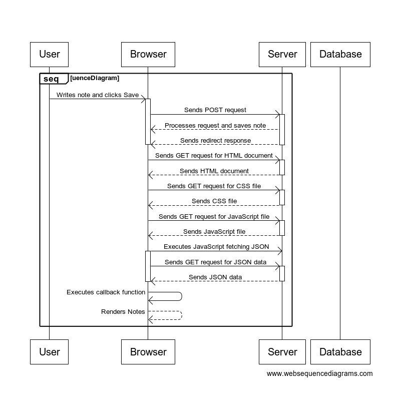
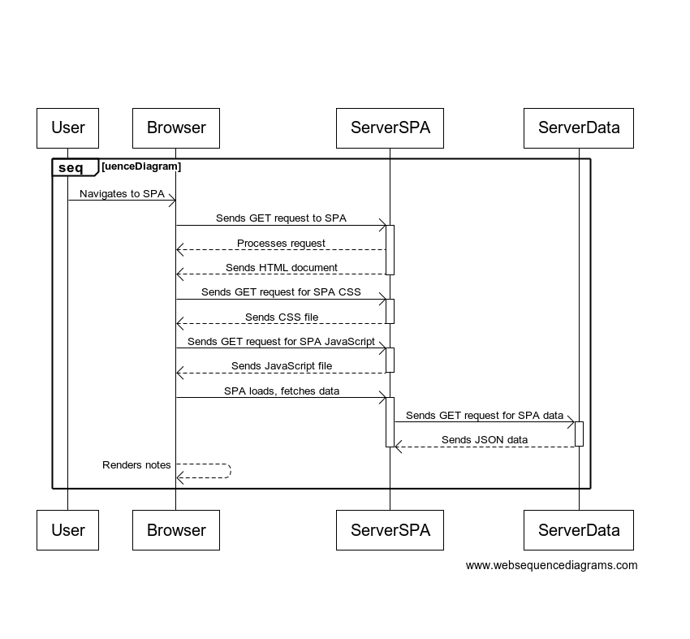
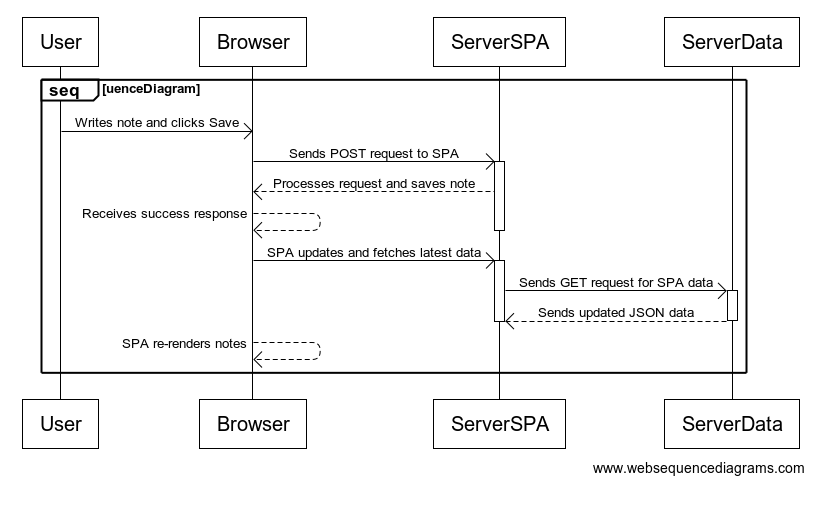

# Full Stack Open - Part 0 Solutions

## Table of Contents
- [Full Stack Open - Part 0 Solutions](#full-stack-open---part-0-solutions)
  - [Table of Contents](#table-of-contents)
  - [Exercise 0.1: HTML](#exercise-01-html)
  - [Exercise 0.2: CSS](#exercise-02-css)
  - [Exercise 0.3: HTML Forms](#exercise-03-html-forms)
  - [Exercise 0.4: New Note Diagram](#exercise-04-new-note-diagram)
  - [Exercise 0.5: Single Page App Diagram](#exercise-05-single-page-app-diagram)
  - [Exercise 0.6: New Note in Single Page App Diagram](#exercise-06-new-note-in-single-page-app-diagram)

## Exercise 0.1: HTML
- &#9745; Review the basics of HTML by reading [this tutorial from Mozilla](https://developer.mozilla.org/en-US/docs/Web/HTML/Guide), known as the HTML tutorial.

## Exercise 0.2: CSS
- &#9745; Review the basics of CSS by reading [this tutorial from Mozilla](https://developer.mozilla.org/en-US/docs/Web/CSS/Guide), known as the CSS tutorial.

## Exercise 0.3: HTML Forms
- &#9745; Learn about the basics of HTML forms by reading [Mozilla's tutorial](https://developer.mozilla.org/en-US/docs/Learn/Forms/Your_first_form), titled "Your first form."

## Exercise 0.4: New Note Diagram
In this exercise, you are required to create a diagram depicting the events that occur when a user creates a new note on the page [https://studies.cs.helsinki.fi/exampleapp/notes](https://studies.cs.helsinki.fi/exampleapp/notes). The provided Mermaid syntax can be used as a reference.

1. **Objective:** Create a new note and observe network traffic.

2. **Steps:**
   - Open your browser's developer tools (`F12` or right-click and select "Inspect").
   - Navigate to the application.
   - Create a new note.
   - Check the "Network" tab in the developer tools for network requests and responses.

3. 

## Exercise 0.5: Single Page App Diagram
Create a diagram illustrating the situation when a user goes to the single-page app version of the notes app at [https://studies.cs.helsinki.fi/exampleapp/spa](https://studies.cs.helsinki.fi/exampleapp/spa).

1. **Objective:** Visit a Single Page Application and analyze network traffic.

2. **Steps:**
   - Open your browser's developer tools.
   - Navigate to the SPA.
   - Check the "Network" tab in the developer tools for network requests and responses.

3. 

## Exercise 0.6: New Note in Single Page App Diagram
Create a diagram illustrating the situation where the user creates a new note using the single-page version of the app.

1. **Objective:** Create a new note in a Single Page Application and analyze network traffic.

2. **Steps:**
   - Open your browser's developer tools.
   - Navigate to the SPA.
   - Create a new note.
   - Check the "Network" tab in the developer tools for network requests and responses.

3. 
